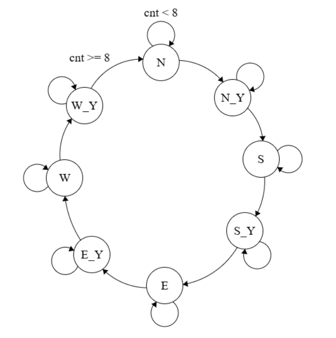

# Four-way traffic light controller FSM
Implementation of a 4-way traffic light FSM in SystemVerilog
 


# Overview

This SystemVerilog module implements a four-way traffic light controller using a finite state machine (FSM). The controller cycles through traffic light states for North, South, East, and West directions with green and yellow light transitions.

## State Diagram
The FSM cycles through these states in the following order:

```
NORTH (N) → NORTH_Y (N_Y) → SOUTH (S_Y) → SOUTH_Y (S_Y) → EAST (E) → EAST_Y (E_Y) → WEST (W) → WEST_Y (W_Y) → (repeat)
```

Where:
- `NORTH`, `SOUTH`, `EAST`, `WEST` represent the **green light** for the respective direction.
- `NORTH_Y`, `SOUTH_Y`, `EAST_Y`, `WEST_Y` represent the **yellow light** transition before switching.

## Module Interface

### **Ports**
| Signal   | Direction | Width | Description |
|----------|----------|------|-------------|
| `clk`    | Input    | 1    | System clock |
| `rst`    | Input    | 1    | Synchronous reset (active high) |
| `n_lights` | Output | 2 | North traffic light (`00=off, 10=green, 01=yellow`) |
| `s_lights` | Output | 2 | South traffic light (`00=off, 10=green, 01=yellow`) |
| `e_lights` | Output | 2 | East traffic light (`00=off, 10=green, 01=yellow`) |
| `w_lights` | Output | 2 | West traffic light (`00=off, 10=green, 01=yellow`) |

### **State Encoding**
| State     | Binary Code | Description |
|-----------|------------|-------------|
| `NORTH`   | 000        | North green, others off |
| `NORTH_Y` | 001        | North yellow, others off |
| `SOUTH`   | 010        | South green, others off |
| `SOUTH_Y` | 011        | South yellow, others off |
| `EAST`    | 100        | East green, others off |
| `EAST_Y`  | 101        | East yellow, others off |
| `WEST`    | 110        | West green, others off |
| `WEST_Y`  | 111        | West yellow, others off |

## Timing Behavior
- Each green state lasts **8 clock cycles**.
- Each yellow state lasts **8 clock cycles**.
- The FSM continuously cycles through the states.

---

**Author:** Kartik Sahajpal  
**License:** MIT  